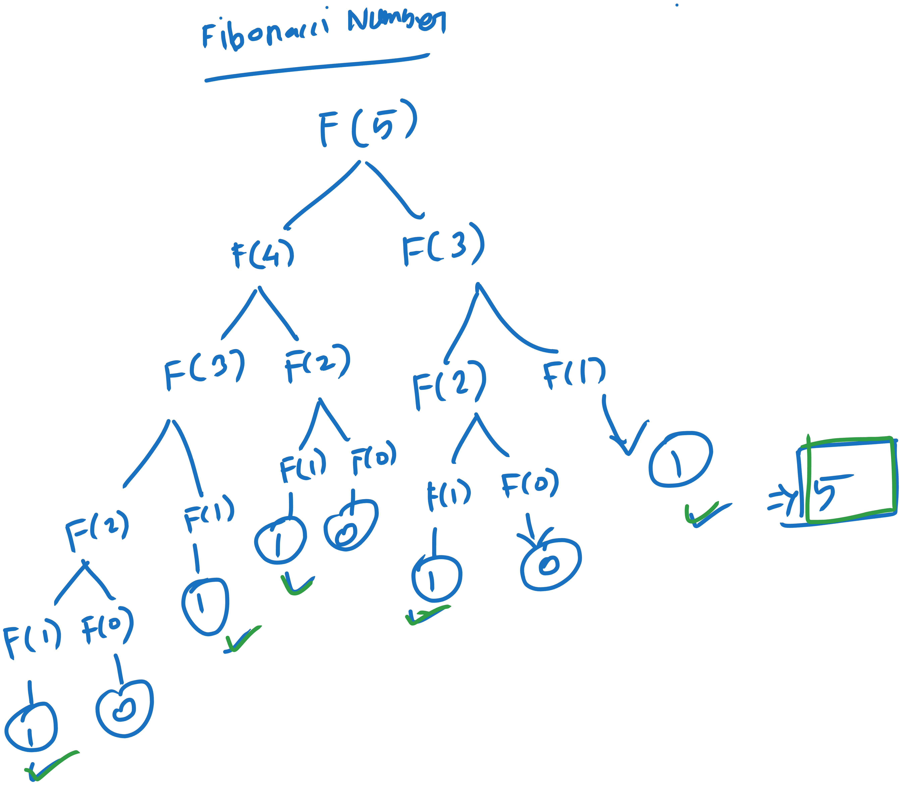

# Table of Contents

- [Introduction to Big O](#introduction-to-big-o)
  - [What “growth trend” means in Big (O)](#what-growth-trend-means-in-big-o)
  - [Best Case, Average Case and Worst Case](#best-case-average-case-and-worst-case)
  - [Sum of first n natural numbers](#sum-of-first-n-natural-numbers)
  - [What is a logarithm?](#what-is-a-logarithm)
- [Recursion](#recursion)
  - [Computability theory](#computability-theory)
  - [Computable Theory Connection With Recursion](#computable-theory-connection-with-recursion)
  - [RecursionError](#recursionerror)
  - [What is Fibonacci?](#what-is-fibonacci)
  - [Fibonacci Expansion for fib(5)](#fibonacci-expansion-for-fib5)
  - [Recurrence Relation](#recurrence-relation)
- [Arrays and strings](#arrays-and-strings)
  - [Strings are Immutable](#strings-are-immutable)

---

# Introduction to Big O

## What “growth trend” means in Big (O)

When we say:

Big-O measures growth trend

We mean:

👉 _How fast the number of operations increases as input size (n) increases_

---

Think of it like this

Instead of asking:

❌ “How many operations does this take exactly?”

We ask:

✅ “If input becomes bigger, how does the work increase?”

---

Example

Algorithm A → n operations

Algorithm B → 5n operations

| n    | A (n) | B (5n) |
| ---- | ----- | ------ |
| 10   | 10    | 50     |
| 100  | 100   | 500    |
| 1000 | 1000  | 5000   |

Yes, B is always 5× slower.

But notice something important:

👉 When n increases → both grow linearly

- 10 → 100 → 1000
- Work also increases in the same pattern

---

Now compare with a different algorithm

Algorithm C → n²

| n    | A (n) | C (n²)    |
| ---- | ----- | --------- |
| 10   | 10    | 100       |
| 100  | 100   | 10,000    |
| 1000 | 1000  | 1,000,000 |

Now the growth is completely different:

👉 This is what Big-O cares about.

---

So what is “exact performance”?

Exact performance includes:

- Constants (5n vs n)
- CPU speed
- Memory
- Compiler optimizations

These vary in real-world scenarios.

Big-O ignores all that and focuses only on:

👉 pattern of growth

---

Simple analogy

- Exact performance → “This car goes 100 km/h vs 120 km/h”
- Growth trend → “This car doubles speed vs this one triples speed over time”

Big-O only cares about the pattern, not the exact numbers.

---

Final understanding

Big-O tells you how an algorithm scales, not how fast it is for a specific input.

---

If you want, I can connect this to real coding examples (loops, nested loops) so it becomes even more intuitive.

Between n² and 2ⁿ, the function 2ⁿ is greater as n becomes large.

---

Why?

Growth comparison

- n² → polynomial growth (slow)
- 2ⁿ → exponential growth (very fast)

---

Let’s see with numbers

| n   | n²  | 2ⁿ        |
| --- | --- | --------- |
| 2   | 4   | 4         |
| 3   | 9   | 8         |
| 5   | 25  | 32        |
| 10  | 100 | 1024      |
| 20  | 400 | 1,048,576 |

At first, they look close. But very quickly:

👉 2ⁿ explodes, while n² grows slowly.

---

Intuition

- In n², you multiply n by itself → controlled growth
- In 2ⁿ, you double the value every time → rapid explosion

Each increase in n:

- n² → adds more work gradually
- 2ⁿ → doubles the work every step

---

Big-O perspective

- O(n²) → manageable for moderate inputs
- O(2ⁿ) → becomes impractical very quickly

That’s why exponential algorithms are considered very inefficient for large inputs.

---

Final takeaway

2ⁿ grows much faster than n², so it is greater for large n.

---

## Best Case, Average Case and Worst Case

Best Case Scenario

The **best case scenario** represents the minimum time or resources an algorithm requires for any valid input.

It occurs when the input is in the most favorable condition for the algorithm.  
 In simple terms, it shows how fast the algorithm can possibly run.

Average Case Scenario

The **average case scenario** represents the expected time or resources an algorithm requires across all possible inputs.

It considers typical input distributions rather than extreme cases.  
 In simple terms, it shows how the algorithm performs in real-world situations.

Worst Case Scenario

The **worst case scenario** represents the maximum time or resources an algorithm may require for any valid input.

It occurs when the input is in the least favorable condition.  
 In simple terms, it shows the upper bound of the algorithm’s performance.

## Sum of first n natural numbers

**1 + 2 + 3 + ... + n** mean?

---

What does

**1 + 2 + 3 + ... + n** mean?

It represents a situation where:

- First step → 1 operation
- Second step → 2 operations
- Third step → 3 operations
- …
- nth step → n operations

👉 Total work = sum of all these = **1 + 2 + 3 + ... + n**

---

The formula

Instead of adding everything manually, we use:

[
frac{n(n+1)}{2}
]

This is called the **sum of first n natural numbers**.

---

Why this formula works (simple intuition)

Pair numbers from start and end:

- (1 + n)
- (2 + n-1)
- (3 + n-2)

Each pair = **n + 1**

Number of such pairs = **n / 2**

So:

[
text{Total} = frac{n}{2} times (n+1)
]

---

Example

If n = 5:

1 + 2 + 3 + 4 + 5 = 15

Using formula:

[
frac{5 times 6}{2} = 15
]

---

Why this matters in algorithms

This pattern usually appears in code like:

for (let i = 1; i <= n; i++) {  
 for (let j = 1; j <= i; j++) {  
 // some work  
 }  
}

Here:

- When i = 1 → 1 iteration
- When i = 2 → 2 iterations
- …
- When i = n → n iterations

Total iterations:

👉 **1 + 2 + 3 + ... + n**

---

Big-O simplification

[
frac{n(n+1)}{2} = frac{n^2 + n}{2}
]

Ignore constants and lower terms:

👉 **O(n²)**

---

Final takeaway

Whenever you see a pattern like  
**1 + 2 + 3 + ... + n**,  
it means total work grows roughly like **n²**.

---

If you want, I can show you a quick trick to instantly recognize such patterns in interviews without doing full math.

## What is a logarithm?

Intuition (very important)

👉 Logarithm counts how many times you divide (or multiply) to reach a value

Example:

Start with 16, keep dividing by 2:

- 16 → 8 → 4 → 2 → 1

That took **4 steps**

So:

log⁡2(16)=4  
Why logs appear in algorithms

Logs show up when:

👉 You repeatedly halve (or divide) the problem

What is a logarithm?

A logarithm answers this question:

“To what power should we raise a base to get a number?”

---

Basic definition

log⁡b(x)=y  
Means b^y=x

# Recursion

## Computability theory

**Computability Theory** is a branch of theoretical computer science that studies **what problems can be solved by a computer and what problems cannot be solved at all**.

It focuses on the _limits of computation_.

---

### 🔹 Core Idea

Computability theory tries to answer:

- Can a problem be solved using an algorithm?
- If yes → how?
- If no → why not?

---

### 🔹 Key Concepts

#### 1. Algorithms & Computation

An **algorithm** is a step-by-step procedure to solve a problem.  
Computability theory examines whether such a procedure **exists** for a given problem.

---

#### 2. Turing Machine

A **Turing Machine** is a mathematical model of a computer introduced by **Alan Turing**.

- It is not a real machine, but a theoretical one.
- It helps define what it means for a problem to be _computable_.

If a Turing machine can solve a problem → the problem is considered **computable**.

---

#### 3. Decidable vs Undecidable Problems

- **Decidable Problem**  
  A problem that can always be solved by an algorithm in finite time.

- **Undecidable Problem**  
  A problem for which **no algorithm exists** that solves all cases.

Example:

- The famous **Halting Problem** asks:  
  _Will a program eventually stop or run forever?_  
  → This problem is **undecidable**.

---

#### 4. Church-Turing Thesis

This principle states that anything that can be computed algorithmically can be computed by a Turing machine.

---

### 🔹 Why It Matters

Computability theory helps you understand:

- The **limitations of software systems**
- Why some problems can **never be automated**
- Foundations of areas like:
  - Compilers
  - Artificial Intelligence
  - Cryptography

---

### 🔹 Simple Analogy

Think of computability theory like asking:

> “Is this problem even solvable by any computer in the universe?”

Not how fast — just **whether it’s possible at all**.

---

If you want, I can connect this to **real-world software engineering** (like why some bugs or validations can never be fully automated).

Computability theory can feel abstract, but it shows up in very real software engineering limits. Here are some practical examples you’ll recognize:

---

### 🔹 1. Infinite Loop Detection (Debugging Reality)

This comes directly from the **Halting Problem**.

**Real-world scenario:**  
You write a function, and someone asks:

> “Can we build a tool that always tells if this code will run forever?”

👉 Answer: **No, not for all programs.**

**What we do instead:**

- Linters warn about _common patterns_
- Timeouts are added (e.g., API calls)
- Manual debugging

But **no tool can guarantee detection of all infinite loops**.

---

### 🔹 2. Static Code Analysis Tools

Tools like ESLint, SonarQube, etc., try to detect:

- Bugs
- Security issues
- Bad patterns

**Limitation:**  
They **cannot catch everything**, because:

- Some problems are **undecidable**
- They rely on heuristics, not perfect analysis

👉 That’s why:

- False positives happen
- Some real bugs are missed

---

### 🔹 3. Virus Detection / Malware Scanning

Antivirus software tries to answer:

> “Is this program malicious?”

This is related to computability limits.

👉 In theory:

- You **cannot perfectly detect all possible malware**

**What happens in practice:**

- Signature-based detection
- Behavior analysis
- Sandboxing

Still, **new or obfuscated malware can bypass detection**.

---

### 🔹 4. Program Equivalence Problem

> “Do these two programs always produce the same output?”

👉 This is **undecidable** in general.

**Real-world impact:**

- Refactoring tools cannot guarantee behavior is unchanged
- Code reviews are still necessary
- Regression testing is critical

---

### 🔹 5. AI & Automation Limits

Even advanced AI systems cannot solve everything.

Example:

- Automatically generating **perfect, bug-free code for any requirement** is impossible in general

Because:

- Some correctness questions reduce to undecidable problems

---

### 🔹 6. Input Validation & Business Rules

You might think:

> “Can I validate every possible incorrect input?”

👉 Not always.

For complex systems:

- Some constraints become **impossible to fully verify algorithmically**
- You rely on:
  - Partial validation
  - Runtime checks
  - Human intervention

---

### 🔹 Key Takeaway

Computability theory explains **why software engineering always involves trade-offs**:

- You can’t build a tool that solves _everything_
- You approximate, optimize, and manage risk

---

### 🔹 Simple Mental Model

> If someone asks:  
> “Can we build a system that always guarantees X for every possible program/input?”

👉 Your instinct should be:

- Maybe… but **computability theory might say no**

---

If you want, I can connect this specifically to your work (e.g., APIs, frontend validation, or system design decisions).

## Computable Theory Connection With Recursion

Computability theory and recursion are tightly connected because **recursion is one of the fundamental ways to define and perform computation**.

---

### 🔹 1. Recursion = A Model of Computation

In computability theory, many functions are defined using **recursion** (functions calling themselves).

There’s even a formal concept called **Recursive function**:

- These are functions defined using base cases + recursive rules
- They represent **computable functions**

👉 In simple terms:

> If a problem can be solved using well-defined recursion → it is _computable_

---

### 🔹 2. Connection to Turing Machine

Even though recursion feels like a programming concept, it’s equivalent in power to a Turing machine.

- Anything you write using recursion  
  ⇄ can be simulated by a Turing machine
- Anything a Turing machine computes  
  ⇄ can be expressed using recursive functions

This equivalence is part of the **Church-Turing Thesis**.

---

### 🔹 3. When Recursion Goes Wrong → Infinite Recursion

This is where computability theory hits real code.

Example:

```js
function loop() {
  return loop();
}
```

👉 This never terminates.

This connects directly to the **Halting Problem**:

- You **cannot always determine** if a recursive function will stop
- Some recursive programs:
  - terminate
  - some don’t
  - and **you can’t always predict which**

---

### 🔹 4. Base Case = Decidability in Practice

Every recursive function needs:

- A **base case** → stopping condition
- A **recursive step**

👉 If the base case is missing or unreachable:

- The function becomes **non-terminating**
- The problem behaves like an **undecidable situation**

---

### 🔹 5. Real-World Developer Insight

When you write recursion (like tree traversal, DFS, etc.):

You are implicitly dealing with computability questions:

- Will this always terminate?
- Are all cases covered?
- Could this loop forever?

👉 That’s why:

- You carefully define base conditions
- You test edge cases
- You avoid unbounded recursion

---

### 🔹 Simple Analogy

Think of recursion like asking:

> “Keep solving smaller versions of the same problem until you can stop.”

Computability theory asks:

> “Are you _guaranteed_ to eventually stop?”

---

### 🔹 Key Takeaway

- Recursion is a **tool to express computation**
- Computability theory tells you **whether that computation is even guaranteed to finish**

---

If you want, I can show how recursion + computability connects to **DFS, backtracking, or API recursion patterns** you might use in real projects.

Recursion didn’t originate from programming—it actually comes from **mathematics and logic**, long before computers existed.

---

### 🔹 1. Mathematical Origins (17th–19th Century)

The idea of recursion appeared when mathematicians started defining things **in terms of themselves**.

A classic early example is the **Factorial**:

- ( n! = n × (n-1)! )
- Base case: ( 0! = 1 )

👉 This is recursion in pure form:

- Define a problem using a **smaller version of itself**

---

### 🔹 2. Formalization in Logic

Recursion became more formal with work by mathematicians studying computation.

One key figure was **Kurt Gödel**:

- Worked on formal systems and definability
- Helped shape the idea of **recursive definitions**

Later, mathematicians defined **recursive (computable) functions** rigorously.

---

### 🔹 3. Connection to Computability Theory

In the 1930s, recursion became central to understanding computation.

- **Alonzo Church** introduced lambda calculus
- **Alan Turing** introduced Turing machines

👉 Key insight:

- Recursive functions = what computers can compute

This is part of the **Church–Turing Thesis**.

---

### 🔹 4. Entry into Programming

Recursion entered programming languages in the 1950s–60s.

- Early functional languages like **Lisp** heavily used recursion
- It became a natural way to process:
  - Trees
  - Graphs
  - Nested structures

---

### 🔹 5. Why Recursion Felt Natural

Recursion mirrors how humans think:

- Break a problem into **smaller subproblems**
- Solve until you reach a **simple base case**

That’s why it appears everywhere:

- File systems (folders inside folders)
- UI trees (React components)
- Algorithms (DFS, divide & conquer)

---

### 🔹 Simple Timeline

- **Mathematics** → recursive definitions (factorial, sequences)
- **Logic** → formal recursive functions
- **Computability theory** → defines what is computable
- **Programming** → practical implementation

---

### 🔹 Key Takeaway

> Recursion started as a **mathematical way of defining problems**,  
> and later became a **core tool for programming and computation**.

---

If you want, I can connect this to **how recursion is actually implemented in memory (call stack)**—that’s where theory meets real execution.

## RecursionError

maximum recursion depth exceeded while calling a Python object

def recursive_fn(i):  
 print(i)  
 recursive_fn(i + 1)  
 return

Yes—this will exceed the stack, but **not because 10,000,000 is special**. It fails much earlier.

---

### 🧠 What actually happens

Your function:

```python
def f(n):
    if n == 0:
        return
    f(n-1)
```

If you call:

```python
f(10_000_000)
```

### Expected behavior (theoretical)

It would create **10 million stack frames**, then unwind.

### Reality in Python

- Python has a **recursion depth limit (~1000 by default)**
- So it will fail around:

```text
f(1000) → RecursionError
```

👉 You will **never reach anywhere near 10 million**

---

### 📦 Why this limit exists

Each recursive call:

- allocates a **stack frame**
- consumes memory (locals, return address, metadata)

If Python allowed unlimited recursion:

- you'd hit a **stack overflow**
- interpreter would crash (like in C)

So Python stops you early with:

```text
RecursionError
```

---

### ⚠️ What if you increase the limit?

```python
import sys
sys.setrecursionlimit(10_000_000)
```

This is **dangerous**.

Why?

- Python stack frames live on the **C stack**
- The OS stack size is limited (usually a few MB)
- 10M calls → **guaranteed crash (segmentation fault)**

👉 You bypass Python safety → OS kills your program

---

### 🔍 Rough intuition

- One stack frame ≈ a few hundred bytes to KB
- 1,000 calls → OK
- 100,000 calls → likely crash
- 10,000,000 → impossible

---

### ✅ Correct way for large `n`

Use iteration:

```python
def f(n):
    while n > 0:
        n -= 1
```

This uses:

- **constant memory (O(1))**
- no stack growth

---

### 💡 Key insight

Recursion depth = **stack depth**, not just "number of steps"

- Recursion → memory grows with depth (O(n))
- Loop → memory stays constant (O(1))

---

If you're exploring this for learning, a good next step is:

- compare recursion vs iteration vs tail recursion
- and why Python doesn’t optimize tail recursion (important concept)

The **Fibonacci sequence** is one of the simplest and most important examples to understand recursion, iteration, and algorithm efficiency.

---

## What is Fibonacci?

The sequence is defined as:

- F(0) = 0
- F(1) = 1
- F(n) = F(n-1) + F(n-2)

So it looks like:

`0, 1, 1, 2, 3, 5, 8, 13, 21, ...`

---

### 🧠 1. Recursive Algorithm (Naive)

This directly follows the mathematical definition.

```python
def fib(n):
    if n <= 1:
        return n
    return fib(n-1) + fib(n-2)
```

### 🔍 How it works

To compute `fib(5)`:

```
fib(5)
= fib(4) + fib(3)
= (fib(3)+fib(2)) + (fib(2)+fib(1))
...
```

#### ❌ Problem

- Recomputes same values many times
- Time Complexity: **O(2ⁿ)** (very slow)
- Space Complexity: **O(n)** (recursion stack)

---

### ⚡ 2. Optimized Recursion (Memoization)

We store already computed results.

```python
def fib(n, memo={}):
    if n in memo:
        return memo[n]
    if n <= 1:
        return n

    memo[n] = fib(n-1, memo) + fib(n-2, memo)
    return memo[n]
```

#### ✅ Benefits

- Avoids recomputation
- Time Complexity: **O(n)**
- Space Complexity: **O(n)**

---

### 🔁 3. Iterative Approach (Best for most cases)

```python
def fib(n):
    if n <= 1:
        return n

    a, b = 0, 1
    for _ in range(2, n+1):
        a, b = b, a + b

    return b
```

#### ✅ Why this is best

- No recursion overhead
- Time Complexity: **O(n)**
- Space Complexity: **O(1)**

---

### 🚀 4. Advanced (Matrix / Fast Doubling)

Used in high-performance systems.

- Time Complexity: **O(log n)**
- Based on mathematical properties of Fibonacci

Example (fast doubling):

```python
def fib(n):
    def helper(n):
        if n == 0:
            return (0, 1)

        a, b = helper(n // 2)
        c = a * (2*b - a)
        d = a*a + b*b

        if n % 2 == 0:
            return (c, d)
        else:
            return (d, c + d)

    return helper(n)[0]
```

---

### 🧩 When to use what?

| Approach      | Use Case                           |
| ------------- | ---------------------------------- |
| Recursion     | Learning / interviews              |
| Memoization   | When recursion is required         |
| Iteration     | Real-world coding (most practical) |
| Fast Doubling | Very large `n` (e.g., 10⁶+)        |

---

### 💡 Intuition (Important)

Fibonacci is basically:

> “Each value depends on the previous two values.”

That’s why:

- It’s a classic example for **recursion**
- It introduces **dynamic programming**
- It helps understand **time vs space trade-offs**

---

If you want, I can next:

- Visualize the recursion tree (very useful)
- Show how this relates to **dynamic programming**
- Or connect Fibonacci to **real-world systems (like caching, trees, etc.)**

Got it — you want a **clean copy format** with a single `##` header and everything else as plain text (no extra markdown blocks or code fences). Here you go:

---

## Fibonacci Expansion for fib(5)



fib(5)
= fib(4) + fib(3)

= (fib(3) + fib(2)) + (fib(2) + fib(1))

= ((fib(2) + fib(1)) + (fib(1) + fib(0))) + ((fib(1) + fib(0)) + fib(1))

= (((fib(1) + fib(0)) + fib(1)) + (fib(1) + fib(0))) + ((fib(1) + fib(0)) + fib(1))

Now substitute base values:
fib(1) = 1
fib(0) = 0

= (((1 + 0) + 1) + (1 + 0)) + ((1 + 0) + 1)

= ((1 + 1) + 1) + (1 + 1)

= (2 + 1) + 2

= 3 + 2

= 5

---

## Recurrence Relation

### Definition

A recurrence relation is a way to define a value using previous values of the same problem.

### Simple Explanation

Instead of solving a problem directly, you express it in terms of smaller versions of itself.

### Example (Fibonacci)

F(n) = F(n−1) + F(n−2)

#### Base Cases

F(0) = 0
F(1) = 1

Each value depends on earlier values — this is a recurrence relation.

### General Form

T(n) = something involving T(n−1), T(n−2), ...

### Components

#### Recursive Case

How the current value depends on previous values

#### Base Case

Stopping condition

### Examples in Algorithms

#### Factorial

n! = n × (n−1)!

Base case: 0! = 1

#### Binary Search

T(n) = T(n/2) + 1

#### Merge Sort

T(n) = 2T(n/2) + n

### Why It Matters

It helps describe recursive algorithms, analyze time complexity, and understand dynamic programming.

### Intuition

To solve a big problem, break it into smaller problems of the same type.

# Arrays and strings

## Strings are Immutable

In Python, **strings are immutable**.

That means once a string is created, **you cannot change its content in place**.

### Example

```python
s = "hello"
s[0] = "H"   # ❌ This will raise an error
```

You’ll get:

```
TypeError: 'str' object does not support item assignment
```

---

### What you do instead

You create a **new string**:

```python
s = "hello"
s = "H" + s[1:]
print(s)  # "Hello"
```

### Why strings are immutable

- Memory efficiency (can reuse objects)
- Safer (no accidental modification)
- Faster in many internal operations (like hashing for dictionaries)

### Key takeaway

- **Mutable** → can change (e.g., `list`, `dict`)
- **Immutable** → cannot change (e.g., `str`, `tuple`, `int`)

When people say **arrays (1D) and strings are very similar in algorithm problems**, they mean that **both are ordered sequences of elements**, so many algorithms work on them in the same way.

Let's break it down.

---

## Why Array and String are Ordered Group of Elements

### 1. Ordered Group of Elements

An **ordered group** means the elements have a **fixed position (index)**.

Example:

Array:

```
[10, 20, 30, 40]
 0   1   2   3
```

String:

```
"CODE"
 0 1 2 3
```

Both:

- Have **indexes**
- Can access elements using index
- Maintain **order**

Example operations:

```
arr[2] → 30
str[2] → 'D'
```

So algorithmically, they behave similarly.

---

### 2. Both Allow Traversal

You usually solve problems by **iterating through elements**.

Example:

Array

```python
for i in range(len(arr)):
    print(arr[i])
```

String

```python
for i in range(len(s)):
    print(s[i])
```

Same pattern.

---

### 3. Many Algorithms Work on Both

Common algorithm techniques apply to **both arrays and strings**:

| Technique      | Example (Array)      | Example (String)        |
| -------------- | -------------------- | ----------------------- |
| Traversal      | find max element     | count vowels            |
| Two pointers   | pair sum             | palindrome check        |
| Sliding window | subarray sum         | longest substring       |
| Hashing        | frequency of numbers | frequency of characters |

Example:

Palindrome check:

```
s = "madam"
```

Using two pointers:

```
left = 0
right = len(s) - 1
```

Same technique can be used on an array.

---

### 4. The Only Major Difference

| Array                  | String                                 |
| ---------------------- | -------------------------------------- |
| stores numbers/objects | stores characters                      |
| usually mutable        | usually immutable (Python, Java, etc.) |

Example in Python:

```
arr[0] = 100   ✅ allowed
s[0] = 'A'     ❌ not allowed
```

But **algorithmically they are still treated similarly**.

---

✅ **Simple definition**

> Arrays and strings are both **ordered collections of elements that can be accessed by index**, so many algorithm techniques apply to both.

---

## Appending to the end of a list is amortized O(1)

When someone says **“Appending to the end of a list is amortized O(1)”**, they mean:

> On **average**, adding an element to the end of a list takes **constant time**, even though **some individual operations may take longer**.

Let’s break it down.

---

### 1. Normal Append (O(1))

In languages like **Python**, when you do:

```python
arr = []
arr.append(10)
arr.append(20)
```

The list internally has **extra unused capacity**.

Example internal structure:

```
Capacity: 8
Size: 3
[1, 2, 3, _, _, _, _, _]
```

If there is **free space**, the element is simply placed at the next index.

```
[1, 2, 3, 4, _, _, _, _]
```

This operation takes **constant time → O(1)**.

---

### 2. When the List Becomes Full

Sometimes the list **runs out of space**.

Example:

```
Capacity: 4
Size: 4
[1,2,3,4]
```

If we append:

```python
arr.append(5)
```

The system must:

1. Allocate a **larger array** (usually 2× size)
2. Copy all elements
3. Add the new element

Example:

```
Old: [1,2,3,4]
New: [1,2,3,4,5,_,_,_]
```

This step costs **O(n)** because all elements are copied.

---

### 3. Why It Is Still “Amortized O(1)”

The expensive **resize operation happens rarely**.

Example sequence of appends:

| Operation         | Cost |
| ----------------- | ---- |
| append 1          | O(1) |
| append 2          | O(1) |
| append 3          | O(1) |
| append 4          | O(1) |
| append 5 (resize) | O(n) |
| append 6          | O(1) |
| append 7          | O(1) |

If you append **1000 elements**, resizing may happen **only ~10 times**.

So the **total cost spread over all operations** becomes:

[
\text{Average cost per append} = O(1)
]

This is called **amortized analysis**.

---

### 4. Simple Analogy

Think of a **notebook**.

- Writing on the next page → **fast**
- When notebook is full → **buy a new bigger notebook and copy notes**

Buying happens **rarely**, so **average writing time per note is still constant**.

---

✅ **Final meaning**

> **Appending to a list is amortized O(1)** means that although **some appends take O(n)** due to resizing, **the average time per append across many operations is constant**.

---

If you'd like, I can also show a **visual step-by-step memory growth of a Python list (0 → 1 → 2 → 4 → 8 → 16)** which makes this concept extremely clear for algorithm interviews.
